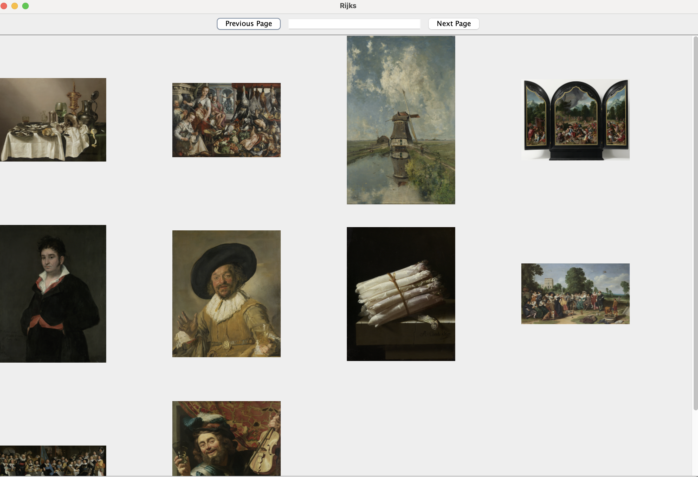
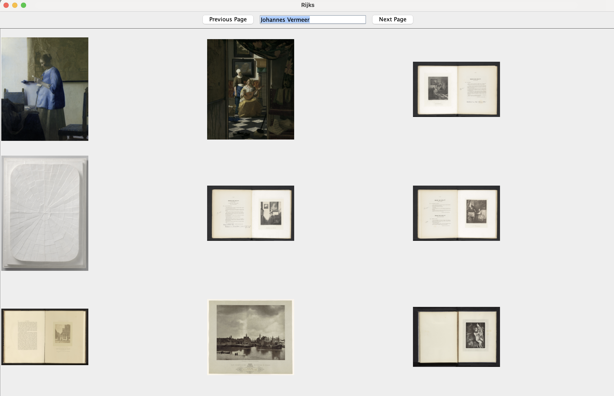

# Rijks Museum Art Browser
The Rijks Museum Art Browser is a Java Swing application that allows users to search, browse, and view artworks from the Rijksmuseum's collection using the Rijksmuseum API.

### Documentation 
[Tooltip](https://docs.oracle.com/javase%2Ftutorial%2Fuiswing%2F%2F/components/tooltip.html)
[ClickListener](https://stackoverflow.com/a/34614434)
[Scroll Pane](https://docs.oracle.com/javase%2Ftutorial%2F/uiswing/components/scrollpane.html)

### Technologies 
[RxJava](https://github.com/ReactiveX/RxJava)
[Rijks API](https://data.rijksmuseum.nl/object-metadata/api/#collection-api

